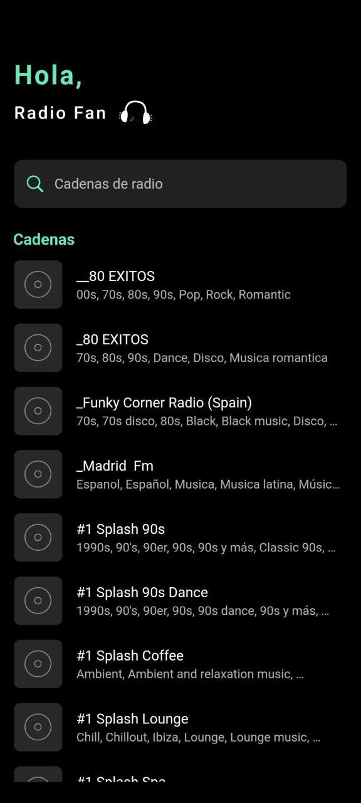
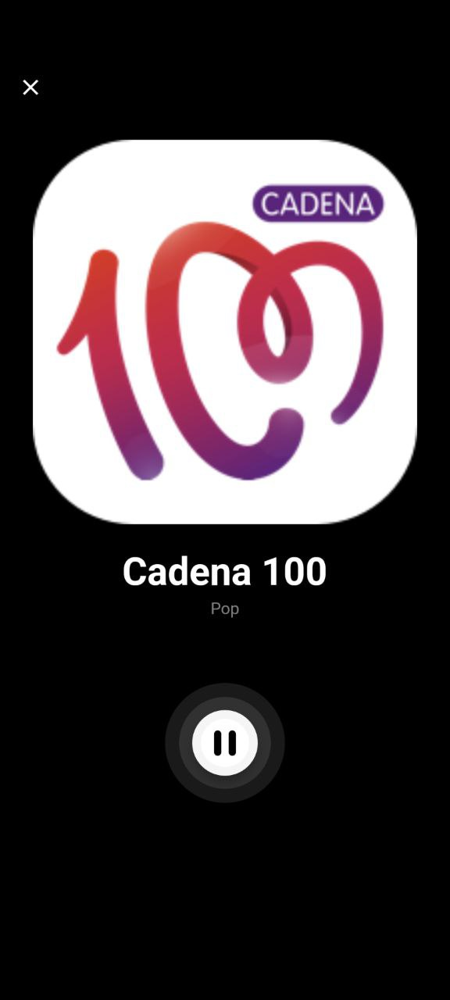

# Radio App

## Description

The Radio Channel App is a Flutter application that allows users to browse and listen to various radio channels. The app provides a user-friendly interface with two main screens:

1. 📻 **Channel List Screen:** Browse through a list of radio channels, each represented by a name and an image. Select the channel you want to listen to.

2. 🎧 **Radio Player Screen:** Upon selecting a channel, enjoy a seamless audio streaming experience with playback controls. The screen displays the channel's logo and allows you to control the audio stream.

3. 🔍 **Search for Specific Channels:** Use the built-in search feature to find specific radio channels. Simply type the name or keywords related to the channel you're looking for.

## Features

- Browse and select from a variety of radio channels.
- Enjoy smooth audio streaming with playback controls.
- Clean and intuitive user interface for easy navigation.
- Two screens: Channel List and Radio Player.
- Built-in search functionality to find specific radio channels.
- Built using clean architecture principles with Cubit and Bloc.
- Access your favorite radio content on-the-go.

## Getting Started

1. Clone the repository.
2. Make sure you have Flutter installed.
3. Run `flutter pub get` to fetch dependencies.
4. Run the app on your preferred device using `flutter run`.
